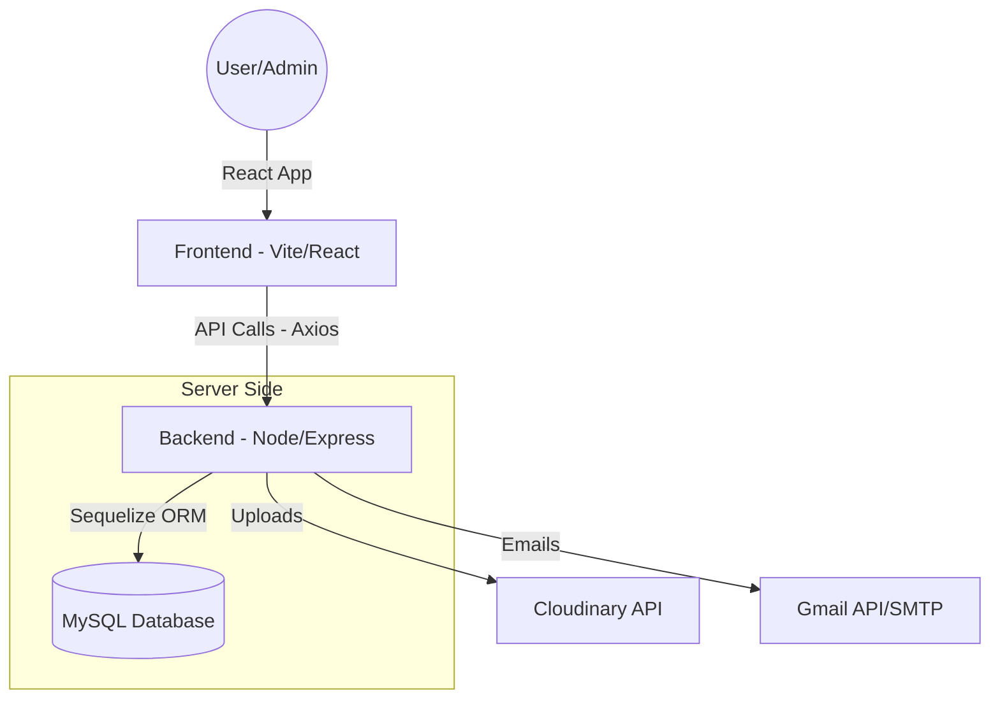

# 🏥 Yashoda Bhawan - Modern Hostel Management System

<p align="center">
  
</p>

### 🎥 Welcome to Yashoda Bhawan
<p align="center">
  <video src="./client/public/Welcome.mp4" width="100%" controls autoplay muted></video>
</p>

Yashoda Bhawan is a premium, full-stack hostel management application designed to streamline student registration, attendance tracking, room allocation, and administrative tasks. It provides a modern, responsive interface for both students and administrators.

---

## 🚀 Features

### 👤 For Users (Students)
- **Hassle-free Registration**: Quick onboarding with multi-step registration forms.
- **Personal Dashboard**: View profile details, attendance history, and payment status.
- **Room Gallery**: Explore available high-quality room photos and amenities.
- **Secure Authentication**: JWT-based login with encrypted sensitive data.
- **Invoice/Receipts**: Download PDF receipts for payments and stays.

### 🛡️ For Administrators
- **Comprehensive Dashboard**: Overview of total students, rooms, and attendance.
- **Attendance Management**: Real-time marking and tracking of student presence.
- **Room Management**: Easy updates for room availability and galleries.
- **Site Settings**: Centralized control over branding, logos, and hero media (videos/banners).
- **Data Security**: PII (Personally Identifiable Information) encryption at the database level.

---

## 🛠️ Tech Stack

| Layer | Technologies |
|---|---|
| **Frontend** | React 19, Vite, Tailwind CSS, Framer Motion, TypeScript |
| **Backend** | Node.js, Express |
| **Database** | MySQL, Sequelize (ORM) |
| **Storage** | Cloudinary (Media Hosting) |
| **Auth/Security** | JWT, Bcrypt.js, Helmet.js, Crypto-based PII Encryption |
| **Communication** | Nodemailer, Gmail API |
| **UI Components** | Lucide React, Shadcn UI, Swiper.js |

---

## 🛠️ Step-by-Step Workflow (How it Works)

1.  **Student Registration**: New students fill out a comprehensive form with personal details, educational info, and guardian contacts.
2.  **OTP Verification**: Secure email-based OTP (One-Time Password) verification ensures the student's email is valid.
3.  **Administrator Approval**: Once registered, student profiles appear in the Admin Dashboard as "Pending". Admins review and verify the documents.
4.  **Room Allocation**: Admins assign students to specific rooms based on type (Single/Shared) and availability.
5.  **Payment & Invoicing**: Students can view their payment history and amounts. Admins can generate and issue digital receipts (PDFs) for stay and mess charges.
6.  **Attendance Tracking**: Daily attendance is marked by administrators, providing a historical record of student presence.

---

## 🏗️ Architecture



---

## ⚙️ Setup & Configuration

### Prerequisites
- Node.js (v18+)
- MySQL Server
- Cloudinary & Gmail API credentials

### Installation

1. **Clone & Install**
   ```bash
   git clone <repository-url>
   npm run install-all
   ```

2. **Environment Variables**
   Configure your environment variables in a `.env` file within the `server/` directory. You will need to set:
   - Database connection settings (Host, User, Password, DB Name)
   - JSON Web Token (JWT) secret for authentication
   - Cloudinary keys for image/video hosting
   - Email credentials for notifications and OTPs
   - Encryption keys for securing student PII

3. **Launch**
   - **Dev Mode**: `npm run dev`
   - **Production build**: `npm run build`

---

## 📄 License
Individual/Commercial License - *Refer to project documentation for details.*

Developed with ❤️ for Yashoda Bhawan.
